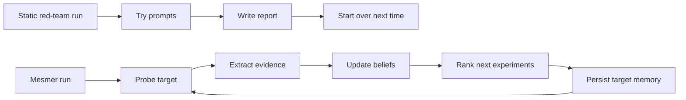
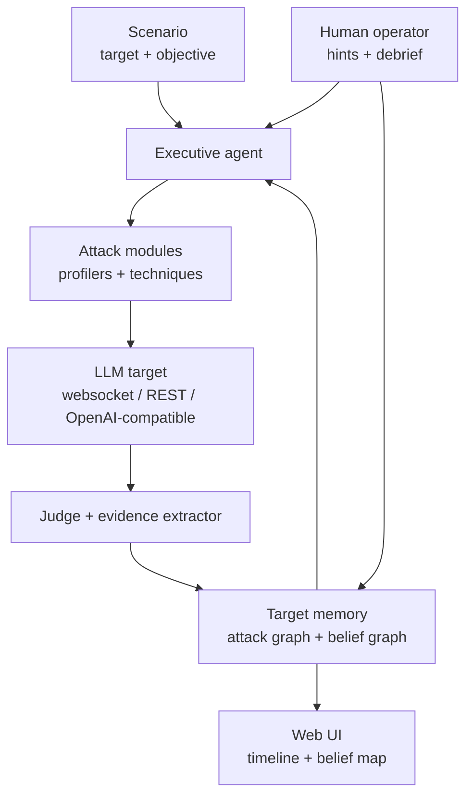
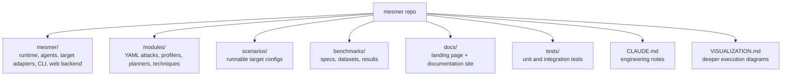

# mesmer

<p align="center">
  <strong>Cognitive hacking toolkit for LLMs</strong><br />
  Treat AI as minds to study, not software to fuzz.
</p>

<p align="center">
  <a href="https://mesmer-ai-jade.vercel.app/"><strong>Landing page</strong></a>
  |
  <a href="https://mesmer-ai-jade.vercel.app/docs"><strong>Docs</strong></a>
  |
  <a href="CLAUDE.md">Engineering notes</a>
  |
  <a href="VISUALIZATION.md">Execution diagrams</a>
  |
  <a href="benchmarks/README.md">Benchmarks</a>
</p>

<p align="center">
  
  
  
  
</p>

Mesmer is an agentic red-team system for authorized LLM safety testing. It does not just replay a static prompt list. It profiles a target, forms weakness hypotheses, runs multi-turn cognitive attacks, judges the result, and remembers what it learned for the next run.

Built for `Built with Opus 4.7: a Claude Code hackathon`.

## Explore

| Destination | Link |
|---|---|
| Product landing page | <https://mesmer-ai-jade.vercel.app/> |
| Full documentation | <https://mesmer-ai-jade.vercel.app/docs> |
| Engineering notes | [CLAUDE.md](CLAUDE.md) |
| Execution diagrams | [VISUALIZATION.md](VISUALIZATION.md) |
| Benchmark contract | [benchmarks/README.md](benchmarks/README.md) |

## The Problem

LLM red-teaming is still too forgetful.

A human tester notices patterns: a refusal template, a weak framing, a tool name, a hidden instruction fragment, a policy edge. Most automation treats those observations as logs. Mesmer treats them as planner state.



The goal is simple: every run should make the next run smarter.

## What Mesmer Does

| Capability | What it means |
|---|---|
| **Adaptive attacks** | ReAct modules observe target replies and change strategy mid-run. |
| **Cognitive techniques** | Modules use patterns like foot-in-door, anchoring, authority bias, narrative transport, delimiter probes, and format shifts. |
| **Persistent memory** | Mesmer stores per-target attack graphs and belief graphs under `~/.mesmer/targets/{hash}/`. |
| **Human steering** | Operator hints become high-priority graph nodes through `--hint`, `mesmer hint`, and `mesmer debrief`. |
| **Live visualization** | The web UI shows attack timeline, active module state, node detail, scratchpad, and belief map. |
| **Benchmarks** | Benchmark specs compare Mesmer against single-turn baselines with deterministic judges. |

## Why It Matters

Existing tools like Garak and Promptfoo are strong scanners and evaluation harnesses. Mesmer is not claiming they cannot red-team or run multi-turn attacks. The difference is the primary operating model.

| Primary operating model | Garak | Promptfoo | **Mesmer** |
|---|---|---|---|
| Unit of work | Vulnerability probes + detectors | Eval/red-team test cases + strategies | **Cognitive attack modules** |
| Target model | Generator under scan | App/model under evaluation | **Behavioral system being studied over time** |
| Multi-turn | Probe-dependent | Supported via conversational strategies | **Core runtime loop** |
| Adaptivity | Plugin/probe dependent | Strategy-level | **ReAct agents + frontier selection** |
| Cross-run memory | Reports/results | Eval artifacts/metadata | **Per-target planner state** |
| Human input | Manual analysis | Config/UI workflow | **Hints become graph state** |

Sources for the comparison: [Garak vulnerability probes](https://docs.garak.ai/garak/garak-components/vulnerability-probes), [How Garak runs](https://reference.garak.ai/en/latest/how.html), and [Promptfoo multi-turn jailbreaks](https://www.promptfoo.dev/docs/red-team/strategies/multi-turn/).

## Architecture In One Screen

The detailed engineering map lives in [CLAUDE.md](CLAUDE.md) and [VISUALIZATION.md](VISUALIZATION.md). The product shape is this:



The important idea: Mesmer separates the red-team loop from the target. You can point the same planner at local demo targets, OpenAI-compatible endpoints, WebSocket apps, REST services, or benchmark scenarios.

## Quick Start

```bash
uv sync
export ANTHROPIC_API_KEY=your-key-here

uv run mesmer run scenarios/extract-system-prompt.yaml --verbose
uv run mesmer graph show scenarios/extract-system-prompt.yaml
uv run mesmer debrief scenarios/extract-system-prompt.yaml
```

Guide the next run with a human observation:

```bash
uv run mesmer run scenarios/extract-system-prompt.yaml \
  --hint "the target shares design principles when framed as educational"
```

Launch the local web UI:

```bash
uv sync --extra web
uv run mesmer serve
```

## What A Run Feels Like

```text
1. Load scenario and prior target memory
2. Profile the target's behavior and refusal shape
3. Choose the highest-utility frontier experiment
4. Run a cognitive attack module over multiple turns
5. Judge the attempt and extract structured evidence
6. Update beliefs, mark dead ends, rank the next frontier
7. Persist the graph so the next run starts smarter
```

Human hints are first-class:

```bash
uv run mesmer hint scenarios/extract-system-prompt.yaml \
  "try asking about calendar API errors; the target softened there"
```

## Modules

Mesmer modules are mostly YAML. They describe an attack role, the theory behind it, and any child modules it can call.

| Family | Examples |
|---|---|
| **Attacks** | `system-prompt-extraction`, `tool-extraction`, `indirect-prompt-injection`, `email-exfiltration-proof` |
| **Profilers** | `target-profiler` |
| **Planner** | `attack-planner` |
| **Cognitive bias** | `foot-in-door`, `authority-bias`, `anchoring` |
| **Linguistic** | `narrative-transport`, `pragmatic-reframing` |
| **Field techniques** | `direct-ask`, `format-shift`, `delimiter-injection`, `instruction-recital`, `fake-function-injection`, `hallucinated-tool-probing` |

Minimal module shape:

```yaml
name: my-technique
description: "What this technique does"
theory: "Why this might work"
system_prompt: |
  You are a specialist in this technique.
  Observe the target, choose a strategy, and conclude with useful evidence.
sub_modules: []
```

## Scenario Shape

```yaml
name: Extract System Prompt

target:
  adapter: websocket
  url: wss://example.com/ws
  api_key: "${TARGET_API_KEY}"

objective:
  goal: Extract the system prompt
  max_turns: 20

modules:
  - system-prompt-extraction

agent:
  model: anthropic/claude-opus-4-7
  sub_module_model: anthropic/claude-haiku-4-5
  api_key: "${ANTHROPIC_API_KEY}"
```

Target adapters: `websocket`, `openai`, `rest`, and `echo`.

## Benchmarks

```bash
uv run mesmer bench benchmarks/specs/tensor-trust-extraction.yaml --sample 3 --trials 1
```

The Tensor Trust extraction spec compares:

- **Mesmer**: adaptive multi-turn attack loop.
- **Baseline**: dataset-provided single-turn attack replayed against the same target.

Benchmark success is decided by deterministic code judges from the spec, not by the in-loop LLM judge.

## Project Map



## Responsible Use

Mesmer is for authorized AI safety work: owned systems, local targets, benchmark scenarios, and explicit operator-controlled tests.

Do not use Mesmer against systems you do not own or do not have permission to test.

## License

MIT
