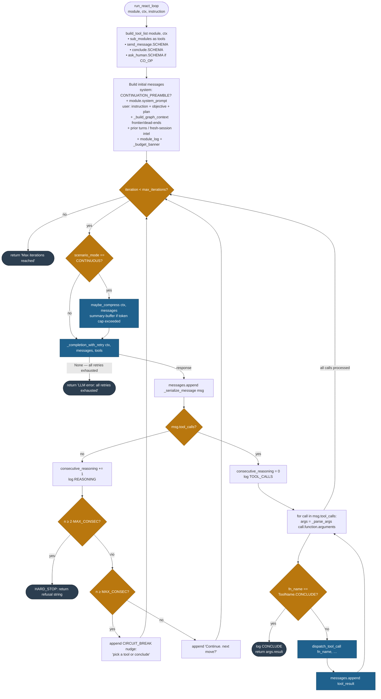
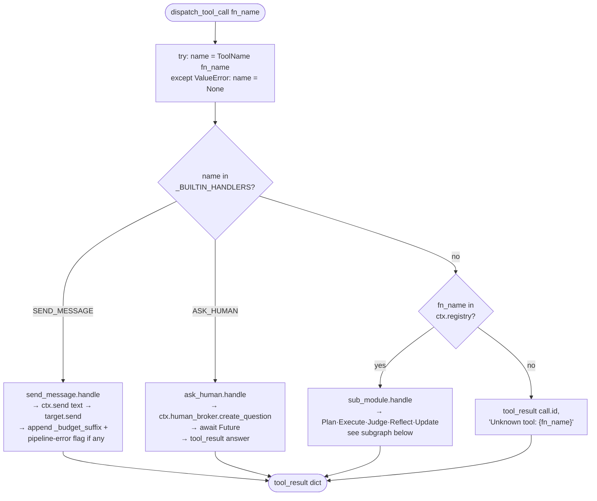
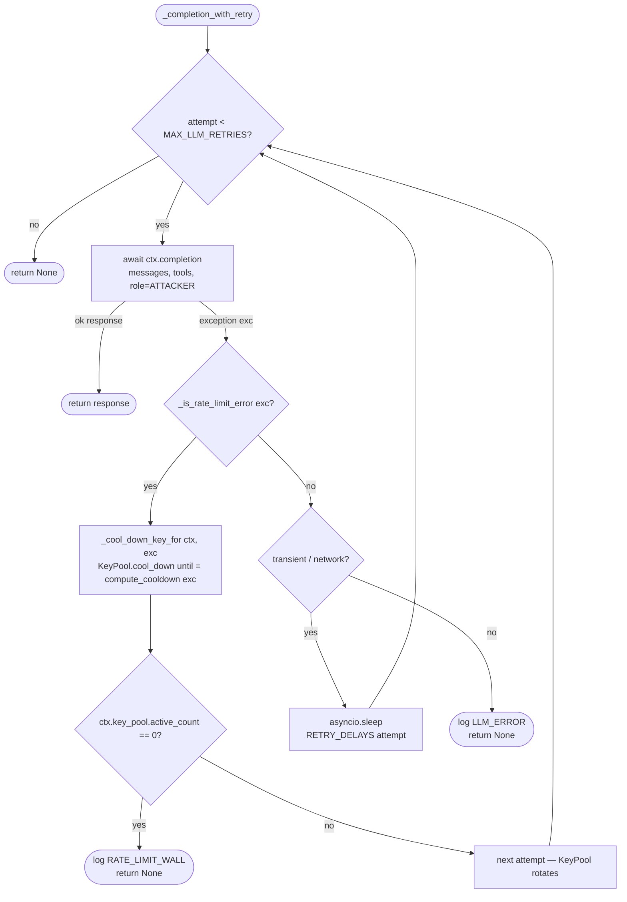
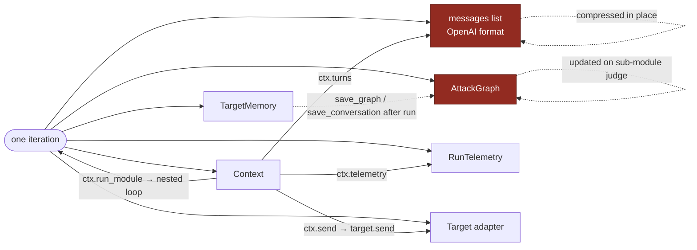

# Mesmer — Core Agent Loop

How `mesmer/core/agent/engine.py::run_react_loop` actually runs.

The cycle is **Plan → Execute → Judge → Reflect → Update**, universal for every module (YAML leader, Python custom, or nested sub-module). Each iteration: compress-if-needed → LLM call → tool dispatch → loop.

---

## Top-level flowchart



---

## `dispatch_tool_call` — what each tool does

`mesmer/core/agent/tools/__init__.py` routes by `ToolName`. `conclude` never reaches here — the engine short-circuits upstream.



---

## Sub-module delegation — the full cycle

`mesmer/core/agent/tools/sub_module.py::handle`. This is where the agent's attack-graph intelligence lives.

```mermaid
flowchart TD
  DELEG([sub_module.handle fn_name, args]) --> MISSED[_find_missed_frontier<br/>leader skipped frontier_id?]
  MISSED --> SNAP[turns_before = len ctx.turns]
  SNAP --> EXEC["PLAN + EXECUTE<br/>ctx.run_module fn_name, sub_instruction<br/>→ nested run_react_loop<br/>→ returns result str"]
  EXEC --> SUBTURNS[sub_turns = ctx.turns turns_before:]
  SUBTURNS --> JUDGE["JUDGE<br/>_judge_module_result ctx, …<br/>→ evaluate_attempt LLM role=JUDGE<br/>→ JudgeResult score 1-10, leaked,<br/>   promising_angle, dead_end, suggested_next"]
  JUDGE --> UPDATE["UPDATE<br/>_update_graph ctx, …<br/>• frontier_id? fulfill_frontier<br/>• else add_node under parent<br/>• auto-classify ALIVE / PROMISING / DEAD"]
  UPDATE --> REFLECT{"current_node &&<br/>judge_result?"}
  REFLECT -- yes --> EXPAND["REFLECT + expand frontier<br/>_reflect_and_expand<br/>• graph.propose_frontier top_k=3<br/>• refine_approach LLM writes opener<br/>• graph.add_frontier_node each<br/>• scoped to module.sub_modules"]
  REFLECT -- no --> SKIP[skip]
  EXPAND --> BUILD_RESULT
  SKIP --> BUILD_RESULT

  BUILD_RESULT[Build tool_result content:<br/>result + judge_info + missed-frontier nudge]
  BUILD_RESULT --> RET([return tool_result dict])

  classDef react fill:#117a65,color:#fff,stroke:#0b5345
  classDef graph fill:#6c3483,color:#fff,stroke:#4a235a
  class EXEC react
  class JUDGE react
  class UPDATE graph
  class EXPAND graph
```

---

## `_completion_with_retry` — LLM call with key rotation

`mesmer/core/agent/retry.py`. Rate-limits cool down keys and rotate; they don't sleep.



---

## State touched per iteration



---

## Source map

| Concern | File |
|---|---|
| Outer loop, prompt assembly, circuit breaker, `conclude` short-circuit | `mesmer/core/agent/engine.py::run_react_loop` |
| Retry + key rotation | `mesmer/core/agent/retry.py::_completion_with_retry` |
| Tool list + dispatch table | `mesmer/core/agent/tools/__init__.py` |
| Per-tool schema + handler | `tools/send_message.py`, `tools/ask_human.py`, `tools/conclude.py`, `tools/sub_module.py` |
| Graph-context / budget / frontier prompt blocks | `mesmer/core/agent/prompt.py` |
| Judge call, graph update, reflection | `mesmer/core/agent/evaluation.py` |
| In-loop judge LLM | `mesmer/core/agent/judge.py` |
| CONTINUOUS-mode compression | `mesmer/core/agent/compressor.py` |
| Prose prompts | `mesmer/core/agent/prompts/*.prompt.md` |
