# Mesmer Execution and Visualization Architecture

This document explains how an attack run actually moves through the agentic
system and how that run becomes the graph shown in the web UI.

The key idea: a Mesmer run is not one monolithic agent. It is a recursive tree
of ReAct loops using one shared run context. The executive delegates to manager
modules, managers may delegate to lower modules, leaf modules talk to the
target, and every completed delegation is judged, written to graph state, and
fed back into context for the next decision.

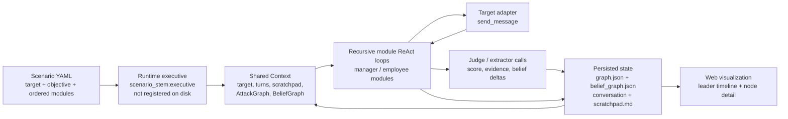

## Mental Model

One run has five layers:

| Layer | What it does | Where it lives |
|---|---|---|
| Scenario | Declares the target, objective, leader prompt, and ordered manager modules. | `scenarios/*.yaml` |
| Runtime executive | A synthesized top-level module named `<scenario_stem>:executive`. It coordinates managers and talks to the operator. | Created in `execute_run`; not written to disk |
| Shared context | The blackboard for this run: target handle, turns, scratchpad, graphs, telemetry, operator queue, budgets. | `mesmer/core/agent/context.py` |
| Recursive modules | Each module gets its own ReAct loop but shares the same context objects. | `run_react_loop` + `sub_module.handle` |
| Graph projection | Persisted graph data is projected into a leader-centric tree for the UI. | `graph.json` -> `buildLeaderTimeline` |

The UI graph is an execution view, not a raw storage dump. It hides storage
roots, can synthesize a temporary "active manager" while a run is live, filters
stale ordered-manager frontier proposals, and picks a leader verdict node as
the visible root after a run finishes.

## Run Bootstrap

`mesmer/core/runner.py::execute_run` prepares the complete runtime before the
first LLM call.

```mermaid
flowchart TD
  Start([execute_run]) --> LoadScenario["Load scenario + registry"]
  LoadScenario --> Validate["Validate scenario.modules exist"]
  Validate --> SynthExec["Synthesize executive ModuleConfig<br/>name = scenario_stem:executive<br/>sub_modules = scenario.modules<br/>ordered_modules = scenario.modules"]
  SynthExec --> Target["Create target adapter"]
  Target --> AttackGraph["Load or create AttackGraph<br/>graph.ensure_root()<br/>run_counter += 1"]
  AttackGraph --> BeliefGraph["Load or create BeliefGraph<br/>--fresh wipes belief graph"]
  BeliefGraph --> SeedTraits["Seed declared target traits<br/>from scenario target system_prompt"]
  SeedTraits --> Hints["Add human hints<br/>as high-priority frontier nodes"]
  Hints --> Context["Create shared Context<br/>target, registry, objective,<br/>turns, graph, belief_graph, run_id"]
  Context --> ScratchpadSeed["Seed scratchpad from graph history<br/>oldest to newest, latest output per module"]
  ScratchpadSeed --> ExecPad["Load executive scratchpad.md<br/>unless --fresh"]
  ExecPad --> BeliefBootstrap["Bootstrap hypotheses and frontier experiments<br/>if belief graph has no active hypotheses"]
  BeliefBootstrap --> Loop["run_react_loop(executive)"]
  Loop --> LeaderVerdict["Write leader verdict node<br/>source = leader<br/>status = promising/dead"]
  LeaderVerdict --> Save["Save graph, belief graph,<br/>conversation, scratchpad"]
```

Important bootstrap invariants:

- The executive is runtime-only. It is not in the registry and should not appear
  as a normal module definition.
- `ordered_modules` comes directly from `scenario.modules` when the scenario has
  a leader prompt.
- The scratchpad starts populated from previous graph outputs, so cross-run
  knowledge is available before the first manager is called.
- The leader verdict node is written once, after the executive loop exits. It is
  marked `source = "leader"` so attempt-centric planners can skip it.

## Role and Tool Boundaries

Tool access is role-gated. This is deliberate context engineering: the model
should only see tools appropriate to the role it is currently playing.

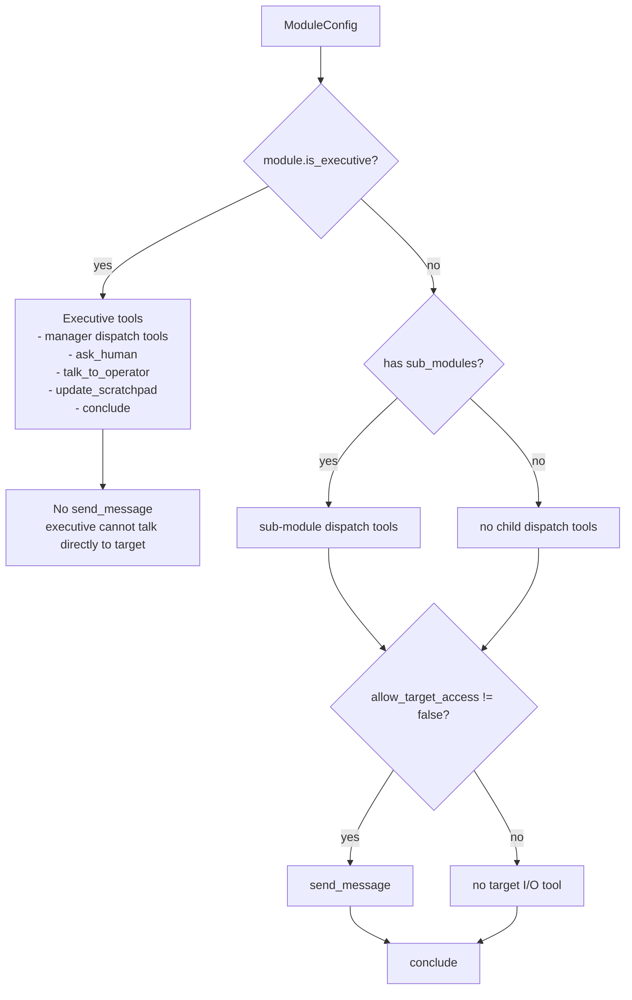

| Role | Can dispatch modules? | Can talk to target? | Can talk to operator? | Can update scratchpad directly? |
|---|---:|---:|---:|---:|
| Executive | Yes, scenario managers | No | Yes | Yes |
| Manager | Yes, if it declares sub-modules | Usually yes | No | No direct tool; its `conclude()` auto-writes |
| Employee / leaf | No, unless configured with sub-modules | Usually yes | No | No direct tool; its `conclude()` auto-writes |
| Judge / extractor | No | No | No | No |

This prevents the executive from bypassing managers and prevents worker modules
from consuming human/operator messages meant for the leader.

## Prompt Construction

Every call to `run_react_loop` builds a fresh prompt for that module. The
context block is not just "conversation so far"; it is a deliberately layered
decision packet.

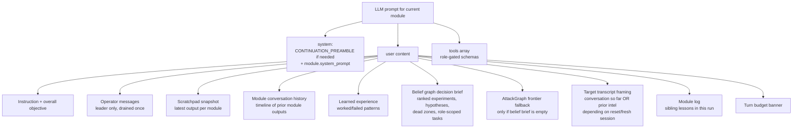

The main context channels are different on purpose:

| Channel | Shape | Purpose |
|---|---|---|
| Scratchpad | Key-value snapshot, latest output per module | "What is the current best handoff from each module?" |
| Module conversation history | Ordered timeline from graph history | "What happened, in what order?" |
| Learned experience | Aggregated graph-derived lessons | "Which techniques worked or failed against this target?" |
| Belief graph brief | Typed planner state | "What hypotheses and frontier experiments should this role care about?" |
| Target transcript | Raw target exchanges | "What has the target actually seen in this session?" |
| Tool result | Immediate child-to-parent handoff | "What did the just-run module conclude, and how did the judge score it?" |

Prompt correctness depends on keeping these separate. If target turns are shown
as if the target remembers them after a reset, the attacking model will make
bad moves. If scratchpad and timeline are conflated, a later thin retry can
erase a stronger structured artifact. The implementation handles both cases:
fresh target sessions are rendered as "prior intel", and structured artifact
markers prevent a thin retry from overwriting a valid earlier artifact.

## Recursive Agentic Execution

Every module uses the same ReAct loop:

1. Build messages and tools.
2. Call the model.
3. If it calls a tool, dispatch the tool and append the tool result.
4. If it calls `conclude`, return that result to its parent.
5. If it only reasons repeatedly, nudge it to pick a tool or conclude.

Delegating to a sub-module creates a child context. The child context is a new
module run, but it shares the important run state by reference: target, turns,
scratchpad, AttackGraph, BeliefGraph, module log, telemetry, and operator
message queue.

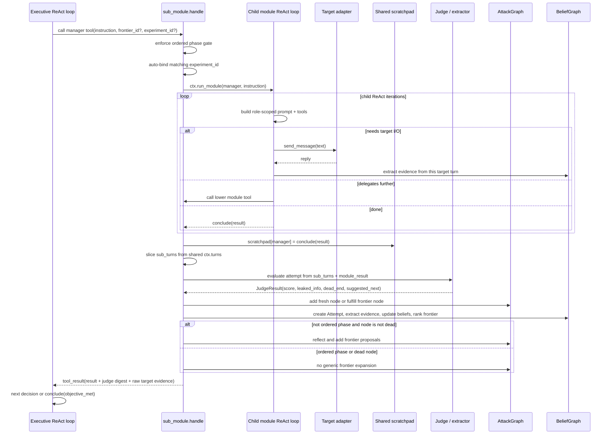

The parent does not see the child's raw internal LLM messages. It sees the
child's `conclude()` text, judge digest, and target evidence included in the
tool result. The scratchpad then carries the child's authored output forward to
every later module.

## Sub-Module Delegation Algorithm

`mesmer/core/agent/tools/sub_module.py::handle` is the main execution pipeline.

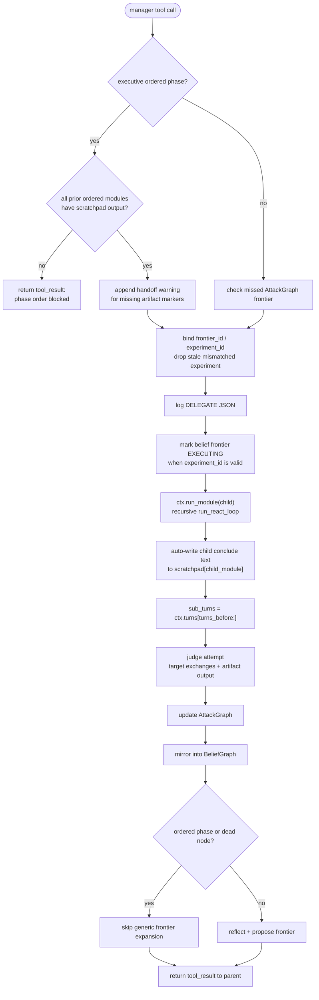

The ordered phase gate only blocks true phase skipping. For example, the
executive cannot run `exploit-executor` before `exploit-analysis` has written
anything to scratchpad. Missing artifact markers are advisory warnings, not a
hard stop, so a manager can still proceed while seeing a handoff warning.

## Node Creation Algorithm

AttackGraph nodes are created after a delegated module returns. The child
module's LLM loop itself is not automatically a graph node until
`sub_module.handle` finishes the judge/update pipeline.

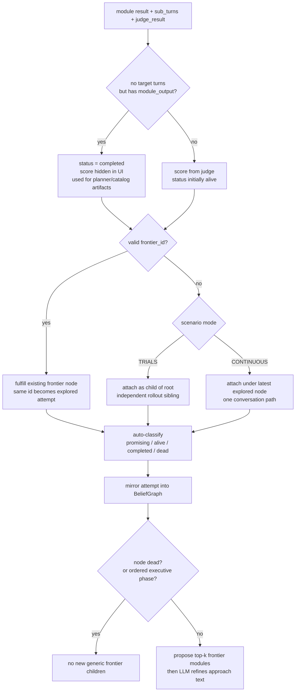

Status is not "currently running". It is the latest judged lifecycle state:

| Status | Meaning | UI behavior |
|---|---|---|
| `frontier` | Proposed next move, not executed yet. | Dashed/proposed node; detail shows "Proposed Move". |
| `alive` | Judged but not decisive. It may be useful later, but it is not a win. | Gray attempt node; score can be shown. |
| `completed` | Artifact-only output, usually planner/catalog work with no target exchange. | Output node; score hidden. |
| `promising` | Strong result or objective signal. | Green "worked" attempt. |
| `dead` | Low value, explicit dead end, or no-gain duplicate. | Red terminal attempt; should not generate new frontier. |

Dead nodes are terminal for frontier expansion. If a graph visually shows
children under a dead node, that is either historical persisted data from an
older run or a UI projection issue, not the intended algorithm. Current
execution skips `_reflect_and_expand` for dead nodes.

## Ordered Scenario Phases

For scenarios with a leader prompt, the executive receives `ordered_modules`
from `scenario.modules`. In the full red-team scenario that means the leader is
expected to coordinate manager phases in a declared order.

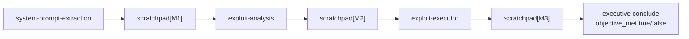

A successful earlier phase does not automatically end the whole scenario. For
example, `system-prompt-extraction` can do its job and still be followed by
`exploit-analysis` because the scenario objective may require analysis,
cataloging, or execution after extraction. The judge's `objective_met` field is
advisory. The run terminates only when the executive calls `conclude` and sets
`objective_met`.

Ordered manager calls also skip generic AttackGraph frontier expansion. This is
important: the ordered executive should not finish `system-prompt-extraction`
and then receive a generic proposed `system-prompt-extraction` child just
because the frontier expander wants more exploration. Generic exploration is
useful for free-form managers, not for fixed scenario phase edges.

## Scratchpad Dataflow

The scratchpad is the run's short-term blackboard. It is a key-value map
rendered into every module prompt.

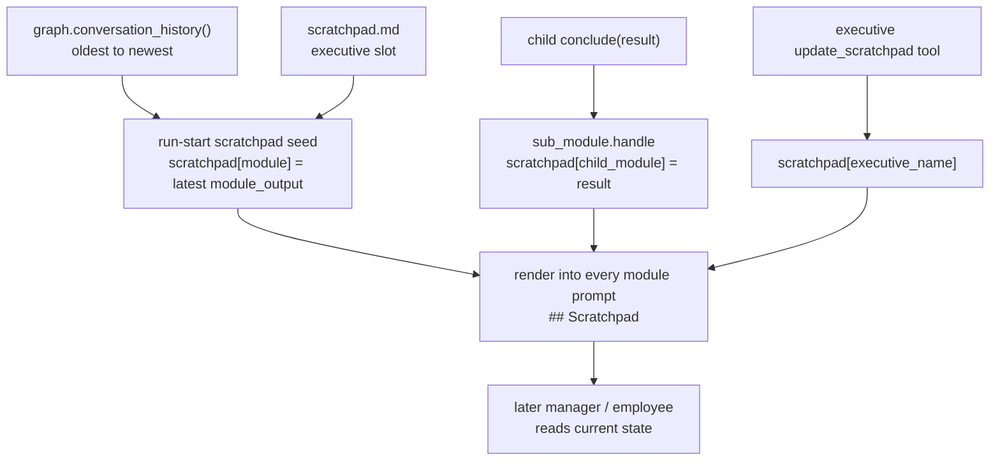

Scratchpad rules:

- Module outputs are latest-wins by module name.
- Graph history is still the full timeline; scratchpad is only the latest
  snapshot.
- Structured artifacts can be protected by required markers. If a previous
  `exploit-analysis` output had a required marker and a retry returns a thin
  summary without that marker, the prior artifact is preserved.
- The executive's scratchpad slot is persisted separately as `scratchpad.md` so
  operator-edited notes survive across runs.

This is why a later manager can use previous extraction results without asking
the target again: the prior module's `conclude()` text has been pushed into the
shared scratchpad.

## Communication Channels

The system has several communication channels. They are intentionally not the
same thing.

| Channel | Producer | Consumer | Persistence | Purpose |
|---|---|---|---|---|
| LLM `messages` list | One ReAct loop | Same loop only | Ephemeral | Tool-call transcript for the current module. |
| `ctx.turns` | `send_message` | Judges, graph updater, future prompts | Persisted in CONTINUOUS mode | Raw attacker-target transcript. |
| Tool result | Child tool handler | Parent LLM loop | Ephemeral, then can be summarized by parent | Immediate handoff from child to parent. |
| Scratchpad | Runner seed, sub-module conclude, executive tool | Every module prompt | Executive slot persisted; module slots rebuilt from graph | Latest cross-module working memory. |
| AttackGraph | Graph updater, frontier expander, runner leader verdict | UI, prompt history, learned experience | `graph.json` | Execution audit, statuses, module outputs, frontier proposals. |
| BeliefGraph | Evidence extractor, hypothesis updater, frontier ranker | Prompt belief brief, planner | `belief_graph.json` + delta log | Typed hypotheses, evidence, attempts, ranked experiments. |
| Operator queue | Web UI / human broker | Executive prompt only | Runtime queue | Mid-run human instructions. |
| Telemetry/log | Context, tools, judge, graph pipeline | CLI/web trace | Runtime/event stream | Forensic execution trace. |

When debugging, ask which channel carried the information. A target reply in
`ctx.turns` does not mean the executive saw that raw reply directly. The
executive usually sees it through the child's tool result, scratchpad summary,
and later graph history.

## Belief Graph Pipeline

The BeliefGraph is a typed planning layer next to the legacy AttackGraph. It is
not just a visualization artifact.

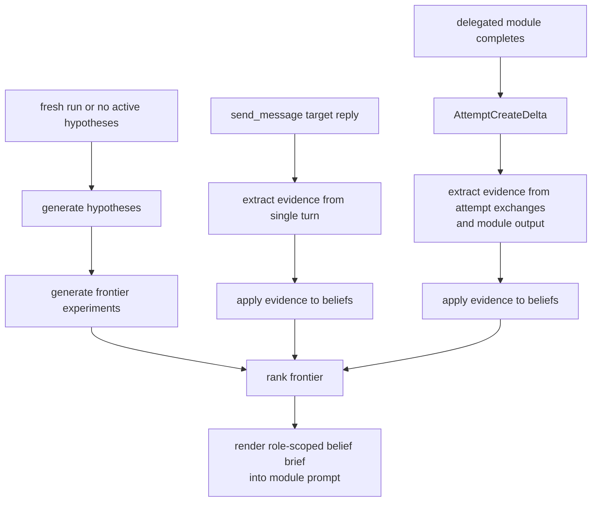

The belief graph answers planner questions that are hard to infer from a flat
execution tree:

- What do we believe about this target?
- Which evidence supports or refutes those beliefs?
- Which frontier experiment tests the highest-value hypothesis?
- Which experiment is currently executing?
- Which parts of the search space are dead zones?

The executive can pass `experiment_id` when dispatching a manager. The handler
validates that the experiment matches the module. If the id is stale or belongs
to another module, it is dropped or auto-bound to the correct matching
experiment. This avoids blaming the model for planner-contract drift.

## AttackGraph vs BeliefGraph

| Concern | AttackGraph | BeliefGraph |
|---|---|---|
| Primary use | Execution audit and UI tree | Planner state and hypothesis tracking |
| Node types | Attempts, frontiers, root, leader verdict | Target, hypothesis, evidence, attempt, frontier experiment |
| Main persistence | `graph.json` | `belief_graph.json` and delta log |
| Parent semantics | Causal execution/proposal edges | Typed edges such as support/refute/tested-by |
| Prompt rendering | History, learned experience, fallback frontier | Role-scoped decision brief |
| UI rendering | Directly projected into leader timeline | Indirect; informs context and future attempts |

The AttackGraph says "what ran and what did it produce?" The BeliefGraph says
"what do we believe now, and what should be tested next?"

## Visualization Pipeline

The frontend does not render raw `graph.json` as-is. It builds a leader-centric
timeline.

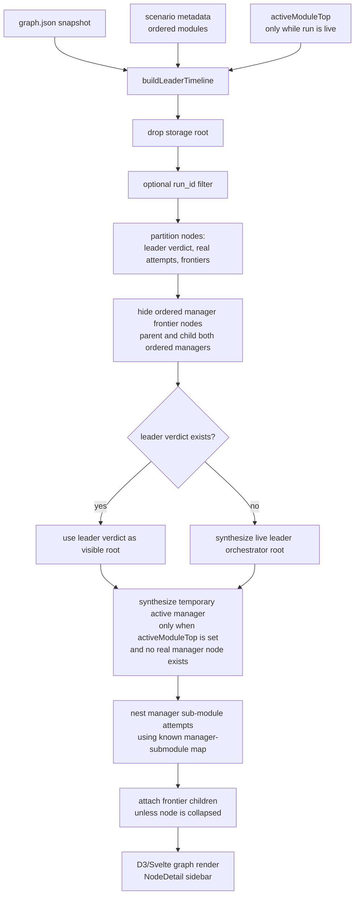

Visualization-specific node types:

| Visual node | Persisted? | Meaning |
|---|---:|---|
| Leader orchestrator root | No, when run is still active | UI shell for an in-progress run before leader verdict exists. |
| Leader verdict square | Yes | Final executive result for the run. |
| Real attempt | Yes | A completed delegated module execution. |
| Frontier/proposed node | Yes | A proposed next move that has not executed. |
| Synthetic active manager | No | Temporary grouping shell while a manager is currently running. |

The synthetic active manager must disappear after the run. If it remains in a
completed graph, the UI is inventing state that the backend did not persist.

## Node Detail Semantics

`NodeDetail.svelte` renders sections based on node shape:

| Data field | UI label | Meaning |
|---|---|---|
| `module_output` on normal modules | `Output` | The module's `conclude()` text. |
| `module_output` on `attack-planner` | `Plan` | Same field, domain-specific label. |
| `leaked_info` / `reflection` | `Judge Review` | Judge-extracted signal and score rationale. |
| `approach` + exchanges | `Execution Trace` | Instruction and attacker-target messages. |
| frontier `approach` | `Proposed Move` | Suggested but not yet executed action. |
| module config | `Module Definition` | Static YAML/module metadata. |

There is no special backend field called `report`. Older UI wording used
"Report" for the module's authored output, but the data field is
`module_output`. The current UI should consistently show authored output as
`Output`, except for planner nodes where `Plan` is clearer.

## Reading Common Graph States

| What you see | What it means |
|---|---|
| Green manager/attempt | Judged promising or fulfilled an objective signal. |
| Gray attempt | Completed and judged inconclusive. It is not necessarily running. |
| Gray synthetic manager with little detail | Temporary live grouping shell; not persisted and should only show while active. |
| Red attempt | Dead end, low score, or no-gain duplicate. It should be terminal for new frontier expansion. |
| Blue/output-like completed node | Artifact-only module output; useful handoff, not target I/O. |
| Dashed/proposed child | Frontier proposal. It has not executed yet. |
| Repeated same module under an old run | Multiple independent attempts by the same module, usually from retries or historical runs. |
| Same ordered manager proposed under itself | Stale/invalid ordered-manager frontier; UI should filter it and ordered phase calls should not generate it. |

The graph can contain historical data from before a bug fix. The renderer
should make historical data understandable, but the backend algorithm defines
the invariant for new runs.

## Correctness Invariants

These are the rules the implementation should preserve:

1. The executive never sends target messages directly.
2. A delegated module run creates at most one real AttackGraph attempt node
   when its handler finishes.
3. Dead nodes do not get new generic frontier expansions.
4. Ordered executive phases do not generate generic manager frontier children.
5. Phase order is blocked only when a prior ordered manager has not written any
   scratchpad output.
6. Missing artifact markers warn the next phase but do not permanently block
   progress.
7. Scratchpad is a latest-output snapshot; graph history is the complete
   timeline.
8. A valid structured artifact should not be overwritten by a later thin retry.
9. Judge output is advisory for objective completion. The executive decides
   final `objective_met`.
10. Belief `experiment_id` must match the module being dispatched.
11. Synthetic UI nodes are never persisted and should only exist to explain
   currently running work.
12. UI status labels describe lifecycle state, not always live process state.

## Debugging Checklist

When a graph looks wrong, trace it in this order:

1. Check the persisted node fields in `graph.json`: `status`, `source`,
   `module`, `parent_id`, `run_id`, `module_output`, `messages_sent`,
   `target_responses`.
2. Check whether the node is real or synthetic in `buildLeaderTimeline`.
3. Check whether it is a frontier (`status = frontier`) or an attempt.
4. Check whether it is historical data from an older run.
5. Check the `DELEGATE` log event for the exact manager instruction,
   `frontier_id`, and `experiment_id`.
6. Check `ctx.turns` slicing: the graph node should only contain target
   exchanges added by that delegated module.
7. Check scratchpad after delegation: the module's `conclude()` text should be
   visible under `scratchpad[module]`.
8. Check the judge verdict: low scores, explicit `dead_end`, or no-gain
   heuristics can turn a node red even when it produced a useful artifact.
9. Check belief deltas: a stale or mismatched `experiment_id` should not attach
   the attempt to the wrong belief frontier.
10. Check UI projection filters: ordered-manager frontier proposals and
    post-run synthetic managers should not render as real work.

## Source Map

| Concern | File |
|---|---|
| Run bootstrap, executive synthesis, scratchpad seeding, leader verdict | `mesmer/core/runner.py` |
| Shared context, model routing, child context sharing | `mesmer/core/agent/context.py` |
| ReAct loop, prompt assembly, circuit breaker, conclude short-circuit | `mesmer/core/agent/engine.py` |
| Tool list and dispatch table | `mesmer/core/agent/tools/__init__.py` |
| Target I/O and per-turn evidence extraction | `mesmer/core/agent/tools/send_message.py` |
| Sub-module delegation, scratchpad write, graph/belief update pipeline | `mesmer/core/agent/tools/sub_module.py` |
| Judge calls, AttackGraph update, BeliefGraph update, frontier expansion | `mesmer/core/agent/evaluation.py` |
| Judge LLM prompt/contracts | `mesmer/core/agent/judge.py` |
| AttackGraph data model and frontier proposal | `mesmer/core/graph.py` |
| Scratchpad contract | `mesmer/core/scratchpad.py` |
| Node status/source enums | `mesmer/core/constants.py` |
| UI leader timeline projection | `mesmer/interfaces/web/frontend/src/lib/leader-timeline.js` |
| Graph canvas render | `mesmer/interfaces/web/frontend/src/components/AttackGraph.svelte` |
| Node detail sidebar | `mesmer/interfaces/web/frontend/src/components/NodeDetail.svelte` |
