# Mesmer Execution and Visualization Architecture

This document explains how a Mesmer run moves through the runtime and how that
runtime becomes the graph shown in the web UI.

The important distinction:

- The **executive** is the scenario-level coordinator. It talks to the operator
  and dispatches managers.
- **Managers and employee modules** do the target-facing work.
- The **scratchpad** is one shared working whiteboard rendered into prompts.
- `module_outputs` is a separate latest-output cache used for phase gates and
  precise handoff checks.
- The **AttackGraph** is the audit log and visualization source.
- The **BeliefGraph** is planner state: hypotheses, evidence, and ranked
  experiments.
- The **UI graph** is a projection of persisted graph state plus a few
  live-only synthetic nodes.

Do not read a high-scoring AttackGraph node as "the next phase has valid
structured input." AttackGraph records execution; judge score is metadata. The
next phase still receives the shared whiteboard plus prior module outputs and
may decide that the prior artifact is too thin or missing required report
sections.

## 1. High-Level Flow

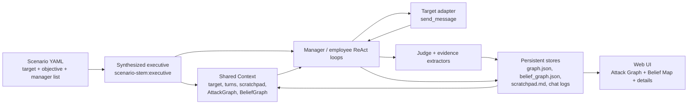

One run is recursive: the executive has a ReAct loop, every manager has its own
ReAct loop, and a manager may dispatch lower modules. They share context by
reference, but each role sees a different tool list.

## 2. Runtime Layers

| Layer | Purpose | Source |
|---|---|---|
| Scenario | Declares target, objective, optional leader prompt, and manager list. | `scenarios/*.yaml` |
| Executive | Runtime-only scenario coordinator. Dispatches managers and talks to the operator. | Synthesized in `mesmer/core/runner.py` |
| Runtime actor | The shared interface consumed by the ReAct loop. Both modules and the executive adapt into this. | `mesmer/core/actor.py` |
| Context | Shared run state: target, turns, scratchpad, graphs, telemetry, operator queue. | `mesmer/core/agent/context.py` |
| Modules | Registry-loaded managers, planners, profilers, and attack techniques. | `modules/**/module.yaml` |
| AttackGraph | Persistent execution audit and UI tree source. | `mesmer/core/graph.py` |
| BeliefGraph | Typed planner state. | `mesmer/core/belief_graph.py` |
| UI projection | Converts graph snapshots into the visible leader timeline. | `leader-timeline.js` |

## 3. Executive vs Module

Conceptually, the executive is **not** a normal user-authored attack module. It
is the scenario agent.

Implementation-wise, both the executive and modules adapt into
`ReactActorSpec`, the runtime contract consumed by the ReAct engine. This keeps
authored module metadata (`ModuleConfig`) separate from runtime actor identity.

Runtime invariants:

- The executive is synthesized in memory as `<scenario-stem>:executive`.
- It is not loaded from `modules/**/module.yaml`.
- It is not discoverable through the registry.
- It is built as `ExecutiveSpec(...).as_actor()` with `ActorRole.EXECUTIVE`.
- Registry modules become actors through `ModuleConfig.as_actor()` with
  `ActorRole.MODULE`.
- It appears in the graph only as the run's final `source="leader"` verdict
  node, or as a live synthetic UI root before the verdict exists.

So the executive is not a module. The common abstraction is now runtime actor:
modules and executives are both actors while running, but only modules are
registry-authored capabilities.

## 4. Tool Boundaries

Tool exposure is declarative. Each `ReactActorSpec` has a `ToolPolicySpec`.
Normal actor construction fills that policy in `ExecutiveSpec.as_actor()` or
`ModuleConfig.as_actor()`. `build_tool_list()` only materializes the policy into
tool schemas. A runtime actor without a policy fails closed instead of deriving
tools from role or parameters.

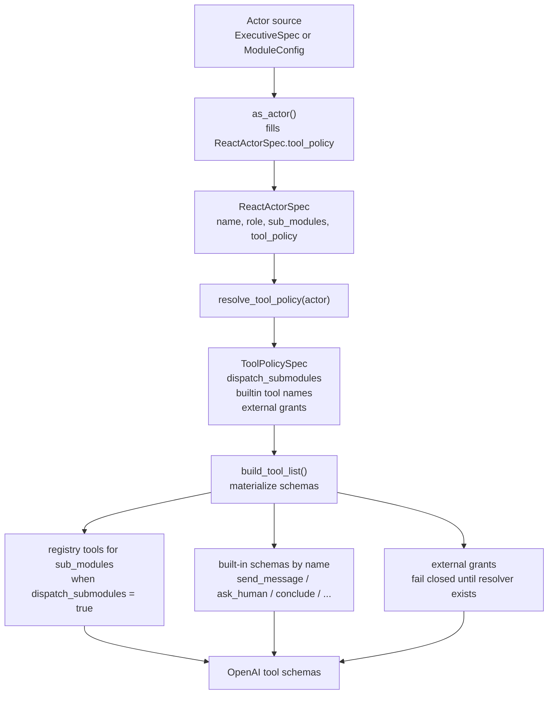

| Actor | Dispatch modules | Talk to target | Talk to operator | Update persistent scratchpad |
|---|---:|---:|---:|---:|
| Executive | Yes, scenario managers | No | Yes | Yes |
| Manager | Yes, if it declares sub-modules | Usually yes | No | No direct tool |
| Employee / leaf | Usually no | Usually yes | No | No direct tool |
| Pure planner | Maybe | No, when opted out | No | No direct tool |
| Judge / extractor | No | No | No | No |

### ToolPolicySpec

`ToolPolicySpec` currently has three fields:

| Field | Meaning |
|---|---|
| `dispatch_submodules` | Whether to expose dynamic registry tools for `actor.sub_modules`. |
| `builtin` | Ordered list of built-in tool names such as `send_message`, `ask_human`, and `conclude`. |
| `external` | Reserved list for future MCP/plugin grants. Declaring these currently fails closed until a resolver exists. |

This makes tool exposure data-driven without opening arbitrary tools by
default. Future MCP or plugin support should add an explicit resolver and
allowlist entries here rather than bypassing `build_tool_list()`.

Declare module tool exposure in top-level YAML:

```yaml
tool_policy:
  dispatch_submodules: false
  builtin:
    - conclude
```

Use this for pure reasoning/planning modules that should only read scratchpad,
history, graph context, or child outputs. Example: `attack-planner` should
produce a strategy, not improvise target messages directly, so its policy omits
`send_message`.

The executive never receives `send_message` because its
`ExecutiveSpec.as_actor()` policy does not grant it.

## 5. Run Bootstrap

`execute_run()` prepares the runtime before the first LLM call.

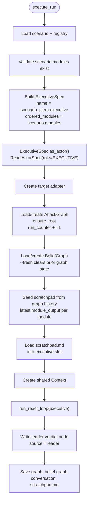

Important details:

- `scenario.modules` becomes the executive's dispatchable manager list.
- When a scenario has a leader prompt, that list also becomes
  `ordered_modules`.
- The executive's persistent notes live in `scratchpad.md`.
- Module slots in the in-memory scratchpad are rebuilt from graph history at run
  start and updated as managers conclude.

## 6. Prompt Construction

Every actor gets a fresh prompt each ReAct iteration. The prompt is a layered
decision packet, not just a transcript.

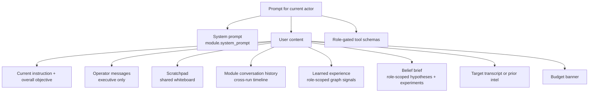

Channels have different meanings:

| Channel | Meaning |
|---|---|
| Scratchpad | Shared markdown whiteboard for concise working state. |
| Module outputs | Latest raw `conclude()` text by module name. |
| Module history | Ordered record of what ran. |
| Target transcript | Raw target exchanges in the current target session. |
| Tool result | Immediate child-to-parent return value. |
| AttackGraph | Persistent attempt audit and UI source. |
| BeliefGraph | Typed planning state and ranked experiments. |

Context blocks are scoped by actor:

| Block | Executive | Manager | Employee / leaf |
|---|---:|---:|---:|
| Overall objective | Yes | Yes | Yes |
| Operator messages | Yes | No | No |
| Scratchpad whiteboard | Yes | Yes | Yes |
| Module conversation history | Yes | Yes | Yes |
| Learned module outcomes | Dispatchable managers only | Dispatchable children only | No |
| Learned reusable evidence | Yes | Yes | Yes |
| BeliefGraph brief | Leader brief unless suppressed | Manager brief | Employee brief |
| Target transcript | Current session, or prior intel after reset | Current session, or prior intel after reset | Current session, or prior intel after reset |

Learned module outcomes are computed only from completed, judged,
non-leader agent execution nodes. Running/pending nodes, unjudged score-0
nodes, human notes, and executive/leader verdict nodes are not learning
signals. This keeps advice actionable: an actor only receives module
success/low-yield summaries for modules it can actually dispatch.

When debugging, first ask: "Which channel was supposed to carry this
information?"

## 7. Scratchpad Contract

The scratchpad is one shared markdown whiteboard rendered into prompts. It is
not the per-module output cache.

```markdown
## Scratchpad — shared whiteboard

## Target
research-l1, Acme Corp research assistant

## Tool Surface
- search/read path likely available
- email side effect likely available

## Next Step
Run indirect-prompt-injection against the protocol-update retrieval path.
```

The framework still keeps a separate `module_outputs` cache:

```text
module_outputs["system-prompt-extraction"] = latest raw conclude text
module_outputs["tool-extraction"] = latest raw conclude text
module_outputs["indirect-prompt-injection"] = latest raw conclude text
```

That cache is for ordered phase gates and audit handoffs. Full history remains
in the AttackGraph.

Dataflow:

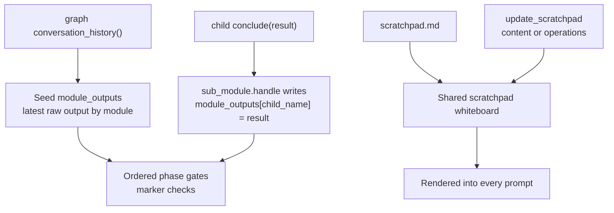

Rules:

- A module's `conclude()` text is auto-written to `module_outputs[module_name]`.
- Latest output wins in `module_outputs`.
- `update_scratchpad` updates the shared whiteboard. It accepts either full
  replacement `content` or patch `operations`.
- The graph remains the complete timeline.
- Structured artifacts can declare required marker strings. If a retry output
  lacks markers and the prior output had them, the prior module output is
  preserved.
- The framework does not parse every report into a typed schema. Module prompts
  are responsible for saying what they need from the whiteboard and graph
  history.

## 8. Why A High-Scoring Phase Can Still Fail The Next Phase

In a multi-manager run, execution status, judge score, and handoff quality are
different signals. For the dvllm research demo:

1. `indirect-prompt-injection` produced an output.
2. The judge scored it `7/10`, so the AttackGraph node is visually high-signal.
3. The output shown in the detail panel might be thin: it may say a
   protocol-update path exists, but not include the exact retrieval path or
   verbatim target evidence.
4. `email-exfiltration-proof` expects usable evidence from the prior
   `indirect-prompt-injection` output, especially a retrieval path and an
   instruction-following quote.
5. The ordered phase gate sees that
   `module_outputs["indirect-prompt-injection"]` is non-empty, so it allows the
   phase to run.
6. Marker checks can detect missing required sections, but today that is an
   advisory handoff warning, not a hard blocker.
7. The proof manager reads the handoff context, cannot find a usable injection
   artifact, and concludes that email proof cannot proceed.

That means the graph algorithm is internally consistent, but it exposes a
quality gap:

- The AttackGraph status answers: "Did this execution complete, fail, or get
  blocked/skipped?"
- The judge score answers: "How useful did the evaluator think the result was?"
- The module-output contract answers: "Did this module produce the artifact the
  next phase needs?"

Those are not the same question.

If we want stricter behavior, there are two implementation options:

- Make ordered artifact requirements hard blockers for later phases.
- Keep the warning, but teach the executive to rerun or repair a thin prior
  artifact before dispatching the next phase.

The current code intentionally chooses the second shape: proceed with a warning
so later phases can honestly report "no usable findings" instead of the runtime
loop getting stuck.

## 9. Delegation Pipeline

`sub_module.handle()` is the main delegation path.

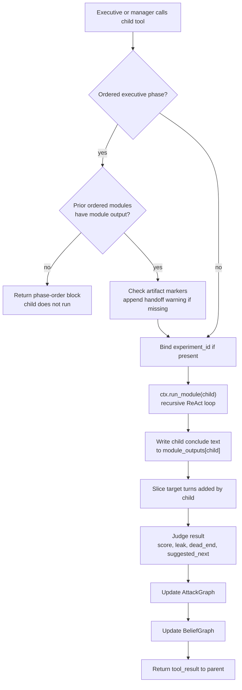

Parent actors do not see a child's private LLM scratch messages. They see:

- the child's `conclude()` text,
- judge digest,
- recent raw target evidence included in the tool result,
- later scratchpad and graph history.

## 10. AttackGraph Contract

AttackGraph parentage is the runtime delegation hierarchy. A node is created
when a module is delegated, starts as `running`, and is completed after the
module returns and judge metadata is available.

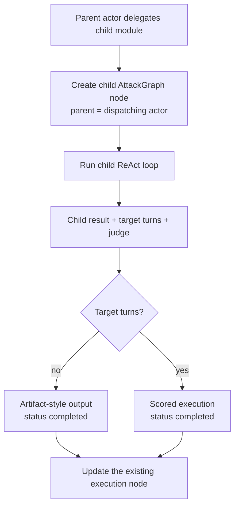

`scenario_mode` affects target session semantics only. It does not choose
AttackGraph parents. Chronological order is represented by timestamps; ancestry
is represented only by delegation.

Each execution node also carries `agent_trace`: the ReAct process for that
actor. This is separate from target exchanges. Target exchanges answer "what
did the attacker say to the target?"; `agent_trace` answers "what did this
actor send to the LLM, what did the LLM return, and which tools ran?"

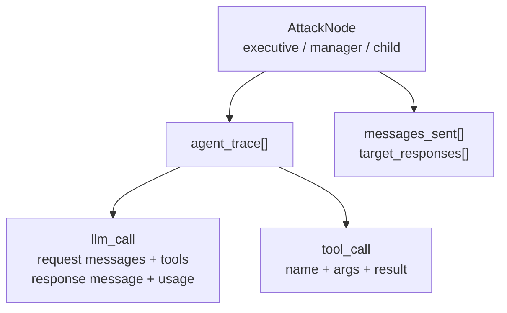

Node status means execution lifecycle only:

| Status | Meaning |
|---|---|
| `pending` | Reserved for an execution record that has not started. |
| `running` | Live synthetic/UI state or an in-progress execution. |
| `completed` | Module ran to conclusion. Judge score may still be low. |
| `failed` | Runtime/tool execution failed. |
| `blocked` | Runtime guard prevented execution. |
| `skipped` | Runtime intentionally skipped execution. |

## 11. Ordered Scenario Phases

For authored multi-manager scenarios, the executive receives the declared
manager order.

```mermaid
flowchart LR
  SPE["system-prompt-extraction"] --> SPEOut["module_outputs[SPE]"]
  SPEOut --> TE["tool-extraction"]
  TE --> TEOut["module_outputs[tool-extraction]"]
  TEOut --> IPI["indirect-prompt-injection"]
  IPI --> IPIOut["module_outputs[indirect-prompt-injection]"]
  IPIOut --> EEP["email-exfiltration-proof"]
  EEP --> EEPOut["module_outputs[email-exfiltration-proof]"]
  EEPOut --> Done["executive conclude"]
```

Order enforcement:

- Later phases are blocked only if an earlier ordered phase has no module output.
- Missing required artifact markers create a handoff warning.
- Ordered phase calls skip generic frontier expansion.
- The executive decides final `objective_met`; judge `objective_met` is
  advisory.

This means "phase 2 has a node" and "phase 2 wrote a usable catalog" are
different checks.

## 12. BeliefGraph Contract

The BeliefGraph is planner state, not the UI execution tree.

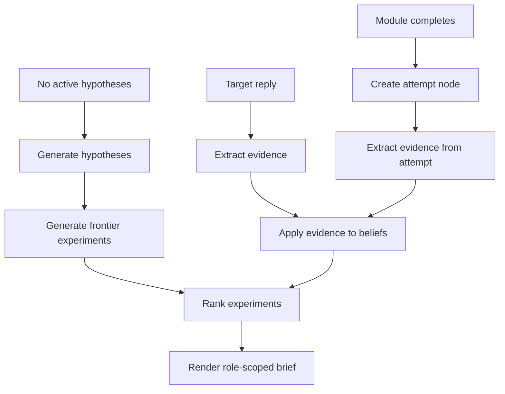

The executive can pass `experiment_id` when dispatching a manager. The handler
validates that the experiment belongs to the chosen module. If not, it drops or
auto-binds the id so attempts do not attach to the wrong hypothesis.

## 13. UI Projection

The frontend drops the storage root, then renders the exact `parent_id`
execution tree. It must not infer hierarchy from scenario YAML, active module
stack, module names, or timestamps.

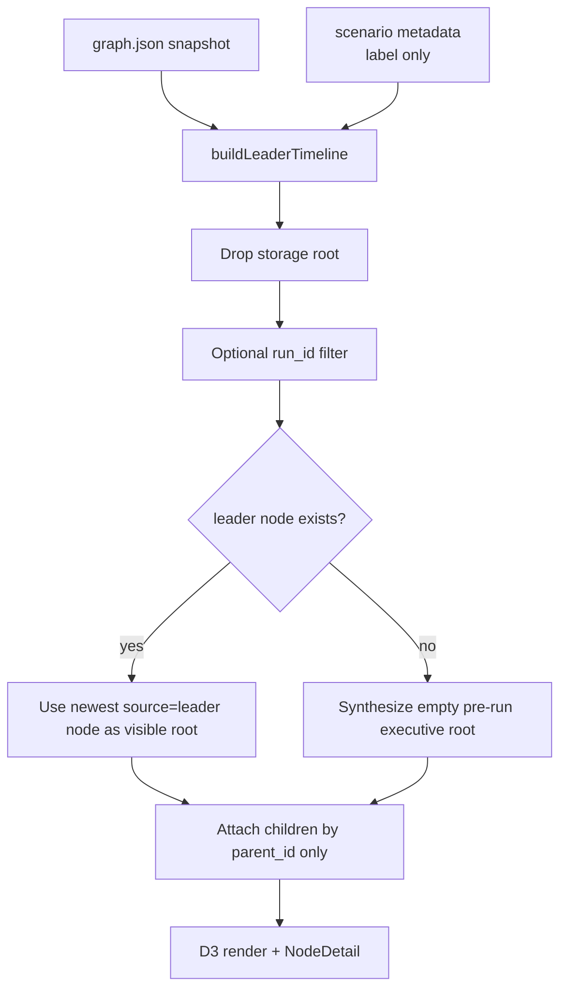

Visual node types:

| Visual node | Persisted? | Meaning |
|---|---:|---|
| Synthetic executive root | No | Empty shell before a run has created its executive node. |
| Executive node | Yes | Scenario executive; created at run start, completed at run end. |
| Manager / child node | Yes | Delegated module execution. Parentage is exact `parent_id`. |

Visual colors:

| Color | Meaning |
|---|---|
| Amber | `running` execution node. |
| Blue | `completed` execution node with no high score. |
| Green | High-scoring completed execution. |
| Red | `failed` or `blocked`. |
| Gray | `pending` or `skipped`. |

## 14. Node Detail Semantics

| Field | UI meaning |
|---|---|
| `module_output` | The module's raw `conclude()` text. |
| `messages_sent` / `target_responses` | Target exchanges added by that module. |
| `leaked_info` / `reflection` | Judge interpretation. |
| `score` | Judge score. Useful, but not a schema-validity proof. |
| `source="leader"` | Executive verdict node. |

The detail panel is useful for auditing exactly why a later module complained.
For a tool-injection run, an `indirect-prompt-injection` detail may show a thin
output, not a full retrieval-path artifact with verbatim target evidence.

## 15. Common Misreads

| What you see | Correct reading |
|---|---|
| High-score `indirect-prompt-injection` | Judge liked the attempt; not proof that a complete retrieval-path artifact exists. |
| `email-exfiltration-proof` with low score | Proof phase ran and concluded no usable side-effect result. |
| Executive displayed on graph | Runtime coordinator or final verdict, not a disk module. |
| `attack-planner` has no target exchange | Expected when its `tool_policy` does not grant `send_message`. |
| Synthetic manager appears/disappears during live run | UI grouping shell based on active module stack. |

## 16. Debugging Checklist

When a graph looks wrong:

1. Inspect the node in `graph.json`: `module`, `status`, `source`,
   `parent_id`, `run_id`, `module_output`, `messages_sent`,
   `target_responses`.
2. Decide if the node is real or synthetic in `buildLeaderTimeline()`.
3. Check the module output cache for the module, not just graph status.
4. For ordered phases, check missing marker warnings in the delegated
   instruction.
5. Check the `DELEGATE` event JSON for exact instruction and `experiment_id`.
6. Check turn slicing: the node should only include target exchanges added by
   that delegated module.
7. Check judge output, but remember it is not a structured artifact validator.
8. Check BeliefGraph deltas for stale or mismatched `experiment_id`.
9. Check whether historical graph data predates current invariants.

## 17. Source Map

| Concern | File |
|---|---|
| Run bootstrap, executive synthesis, leader verdict | `mesmer/core/runner.py` |
| Runtime actor abstraction | `mesmer/core/actor.py` |
| Authored module config and module-to-actor adapter | `mesmer/core/module.py` |
| Tool policy materialization | `mesmer/core/agent/tools/__init__.py` |
| ReAct loop and prompt construction | `mesmer/core/agent/engine.py` |
| Shared context and child contexts | `mesmer/core/agent/context.py` |
| Sub-module delegation and scratchpad writes | `mesmer/core/agent/tools/sub_module.py` |
| Target I/O | `mesmer/core/agent/tools/send_message.py` |
| Executive operator tools | `ask_human.py`, `talk_to_operator.py`, `update_scratchpad.py` |
| Judge and graph/belief updates | `mesmer/core/agent/evaluation.py` |
| AttackGraph model | `mesmer/core/graph.py` |
| Scratchpad model | `mesmer/core/scratchpad.py` |
| BeliefGraph model | `mesmer/core/belief_graph.py` |
| Attack graph UI projection | `mesmer/interfaces/web/frontend/src/lib/leader-timeline.js` |
| Attack graph canvas | `mesmer/interfaces/web/frontend/src/components/AttackGraph.svelte` |
| Node detail panel | `mesmer/interfaces/web/frontend/src/components/NodeDetail.svelte` |
